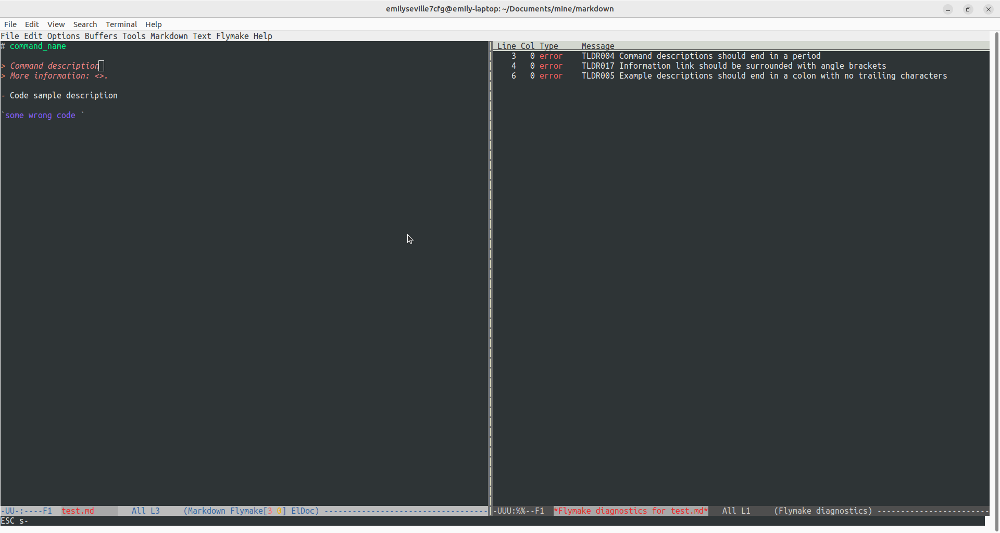
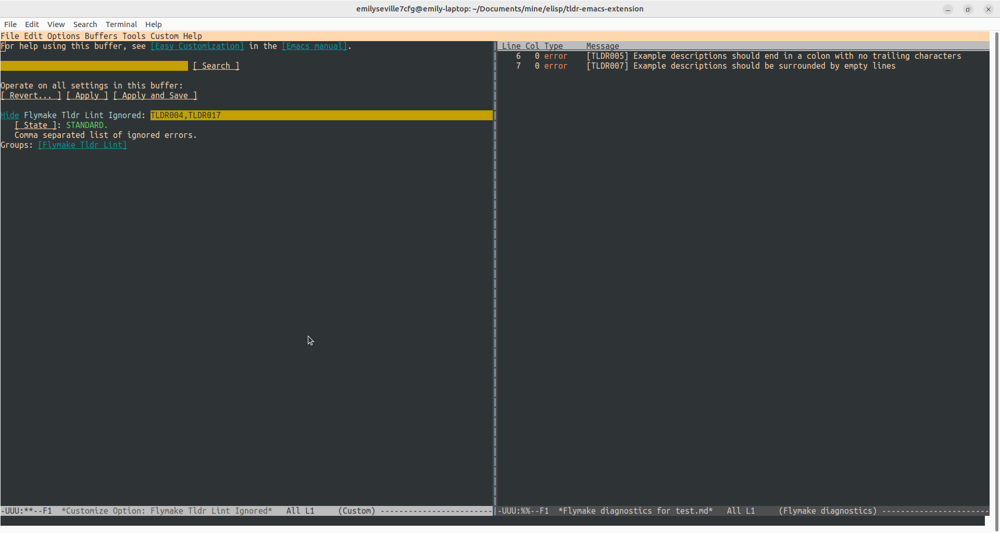

# tldr-emacs-extension

## Requirenments

- `tldr-lint` installed
- `emacs 27.1` higher
- `yasnippet` (optional, if snippets must be enabled)

## Features

- [x] Code linting
- [x] Code snippets
- [ ] Code actions





## Installation

### Copy-paste plugin script contents to `~/.emacs` while enabling lexical-binding

Example `~/.emacs` config:

```emacs
;;; flymake-tldr-lint.el --- A TlDr Flymake backend powered by tldr-lint  -*- lexical-binding: t; -*-
(require 'package)
(add-to-list 'package-archives '("melpa" . "https://melpa.org/packages/") t)
(package-initialize)

;; The extension file content with all comments removed can be placed here.

(add-hook 'markdown-mode-hook 'flymake-tldr-lint-load)

(custom-set-variables
;; custom-set-variables was added by Custom.
;; If you edit it by hand, you could mess it up, so be careful.
;; Your init file should contain only one such instance.
;; If there is more than one, they won't work right.
'(package-selected-packages '(markdown-mode)))
(custom-set-faces
;; custom-set-faces was added by Custom.
;; If you edit it by hand, you could mess it up, so be careful.
;; Your init file should contain only one such instance.
;; If there is more than one, they won't work right.
)
```

## Starting linting

- Use `M-x flymake-mode RET` (view the next chapter below to understand how to interpret `M-x` and `RET`)

## Settings

To change settings `M-x customize-option RET {{flymake-tldr-lint-program|flymake-tldr-lint-ignored}} RET` can be used where:

- `M-x` is `Alt` with `x`
- `RET` is `Enter`.

Settings:

- `flymake-tldr-lint-program` (**default**: `"tldr-lint"`) - executable name
- `flymake-tldr-lint-ignored` (**default**: `""`) - list of ignored errors (as a delimiter any character can be used `TLDR004 TLDR006` or `TLDR004,TLDR006`)
